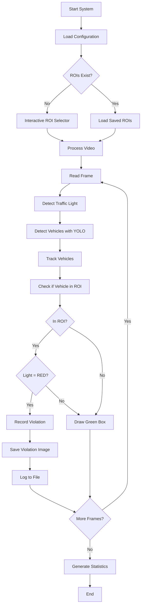

# Enhanced Red Light Violation Detection System

A robust traffic violation detection system using YOLOv10 and OpenCV with support for multiple detection zones, all vehicle types, and interactive ROI selection.

## Features

- ✅ **Multiple Detection Zones**: Draw and monitor multiple violation detection areas
- ✅ **Interactive ROI Selector**: Easy-to-use mouse-based interface for defining detection zones
- ✅ **All Vehicle Types**: Detects cars, trucks, buses, and motorcycles
- ✅ **Improved Tracking**: Enhanced vehicle tracking with IoU matching and adaptive thresholds
- ✅ **Traffic Light Detection**: Robust detection with temporal smoothing to reduce false positives
- ✅ **Configurable Settings**: JSON-based configuration for all parameters
- ✅ **Comprehensive Logging**: Detailed logs of violations and system events
- ✅ **Violation Images**: Automatic saving of violation evidence with metadata
- ✅ **Real-time Statistics**: Live display of violations and tracking information

## Installation

1. **Install dependencies**:
```bash
pip install opencv-python ultralytics numpy
```

2. **Ensure required files are present**:
   - `tr.mp4` - Input video file
   - `coco.txt` - COCO class names
   - `config.json` - Configuration file (created automatically)

## Quick Start

### Option 1: Use Interactive ROI Selector (Recommended)

Run the system with interactive ROI drawing:

```bash
python3 pmain1.py --interactive-roi
```

This will:
1. Show the first frame of your video
2. Allow you to draw detection zones by clicking and dragging
3. Save your zones for future use
4. Start processing the video

**Controls in ROI Selector:**
- **Left Click & Drag**: Draw a new ROI
- **Right Click**: Delete nearest ROI
- **D**: Delete last ROI
- **C**: Clear all ROIs
- **L**: Load saved ROIs from file
- **S**: Save ROIs and start processing
- **Q**: Quit without saving

### Option 2: Use Saved ROIs

If you've already created ROIs, simply run:

```bash
python3 pmain1.py
```

The system will load ROIs from `roi_config.json` automatically.

## Configuration

Edit `config.json` to customize the system:

```json
{
    "video": {
        "input_path": "tr.mp4",           // Input video file
        "output_path": "output_video.avi", // Processed video output
        "frame_width": 1020,               // Output frame width
        "frame_height": 600,               // Output frame height
        "skip_frames": 0                   // Skip frames for faster processing
    },
    "detection": {
        "model_path": "yolov10s.pt",      // YOLO model file
        "confidence_threshold": 0.5,       // Minimum detection confidence
        "vehicle_classes": [               // Vehicle types to monitor
            "car", "truck", "bus", "motorcycle"
        ]
    },
    "tracking": {
        "distance_threshold": 50,          // Max distance for tracking
        "max_disappeared": 30              // Frames before losing track
    },
    "traffic_light": {
        "temporal_frames": 5,              // Frames for temporal smoothing
        "confidence_threshold": 0.6        // Min confidence for light state
    },
    "output": {
        "save_images": true,               // Save violation images
        "images_directory": "saved_images", // Output directory
        "show_video_window": true,         // Display video while processing
        "log_file": "violations.log"       // Log file path
    }
}
```

## Usage Examples

### 1. Preview/Play Video

```bash
# Play your video with controls before processing
python3 pmain1.py --play-video

# Or specify a different video file
python3 pmain1.py --play-video --video-path my_video.mp4
```

**Video Player Controls:**
- **SPACE** - Pause/Resume
- **Q** - Quit
- **R** - Restart from beginning
- **→** (Right Arrow) - Skip forward 10 frames
- **←** (Left Arrow) - Skip backward 10 frames
- **S** - Save current frame as screenshot

### 2. First Time Setup with Interactive ROI

```bash
python3 pmain1.py --interactive-roi
```

Draw your detection zones on the first frame, press 'S' to save and start.

### 3. Process Video with Existing ROIs

```bash
python3 pmain1.py
```

### 4. Use Custom Configuration

```bash
python3 pmain1.py --config my_config.json
```

### 5. Only Create ROIs (Don't Process)

```bash
python3 roi_selector.py tr.mp4
```

This lets you define ROIs without starting video processing.

## Output Files

### Violation Images
- **Location**: `saved_images/YYYY-MM-DD/`
- **Format**: `ROI{N}_ID{vehicle_id}_{vehicle_type}_{timestamp}.jpg`
- **Example**: `ROI1_ID5_car_14-30-45-123.jpg`

### Video Output
- **File**: `output_video.avi`
- **Contains**: Processed video with bounding boxes, ROIs, and statistics

### Logs
- **File**: `violations.log`
- **Contains**: 
  - System events
  - Detection statistics
  - Violation records with timestamps
  - Error messages

### ROI Configuration
- **File**: `roi_config.json`
- **Contains**: Saved detection zone coordinates
- **Format**:
```json
{
    "rois": [
        [x1, y1, x2, y2],
        [x1, y1, x2, y2]
    ],
    "video_path": "tr.mp4",
    "frame_size": [1020, 600]
}
```

## System Components

### 1. `pmain1.py` - Main Detection System
The core system that processes video, detects vehicles, tracks them, and identifies violations.

**Key Features:**
- Loads configuration from JSON
- Manages ROIs (load or create interactively)
- Performs object detection with YOLO
- Tracks vehicles across frames
- Detects traffic light state
- Identifies violations when vehicles enter ROI during red light
- Saves violation images with metadata
- Generates statistics and logs

### 2. `roi_selector.py` - Interactive ROI Tool
Standalone tool for creating detection zones.

**Usage:**
```bash
python3 roi_selector.py [video_path]
```

### 3. `tracker.py` - Enhanced Vehicle Tracker
Improved tracking with:
- Support for both coordinate formats
- IoU-based matching as fallback
- Adaptive distance thresholds
- Disappeared object handling

### 4. `test1.py` - Traffic Light Detector
Advanced traffic light detection with:
- HSV color-based detection
- Temporal smoothing (reduces flickering)
- Confidence scoring
- Support for red, yellow, and green lights

## How It Works



## Violation Detection Logic

A violation is recorded when:
1. **Vehicle Detected**: YOLO detects a vehicle (car, truck, bus, or motorcycle)
2. **In Detection Zone**: Vehicle's center point is inside an ROI polygon
3. **Red Light**: Traffic light detector reports "RED" state
4. **First Occurrence**: This vehicle ID hasn't violated in this ROI before

## Statistics

The system tracks:
- Total frames processed
- Total vehicle detections
- Total violations
- Violations per ROI
- Real-time tracking count

## Troubleshooting

### Issue: No ROIs Detected
**Solution**: Run with `--interactive-roi` flag to create ROIs manually.

### Issue: Too Many False Positives
**Solutions**:
- Increase `confidence_threshold` in config.json (detection section)
- Increase `temporal_frames` for traffic light detection
- Adjust traffic light `confidence_threshold`

### Issue: Vehicles Not Tracked Properly
**Solutions**:
- Increase `distance_threshold` in tracking section
- Increase `max_disappeared` to keep tracking longer

### Issue: Model File Not Found
**Solution**: The system will automatically download `yolov10s.pt` on first run.

### Issue: Traffic Light Not Detected
**Solutions**:
- Adjust `roi_x_max` in config.json (traffic_light section)
- Check traffic light is visible in frame
- Adjust HSV color ranges in test1.py if needed

## Performance Tips

1. **Skip Frames**: Set `skip_frames` to process every Nth frame (faster but less accurate)
2. **Lower Resolution**: Reduce `frame_width` and `frame_height` for faster processing
3. **Disable Window**: Set `show_video_window: false` to process faster
4. **Higher Confidence**: Increase `confidence_threshold` to reduce false detections

## Advanced Usage

### Multiple Configuration Profiles

Create different config files for different scenarios:

```bash
# Daytime configuration
python3 pmain1.py --config config_day.json

# Nighttime configuration
python3 pmain1.py --config config_night.json

# High traffic configuration
python3 pmain1.py --config config_busy.json
```

### Batch Processing

Process multiple videos:

```bash
for video in *.mp4; do
    # Update config with video path
    python3 pmain1.py --config config.json
done
```

## System Requirements

- Python 3.7+
- OpenCV 4.0+
- Ultralytics YOLO
- NumPy
- 4GB+ RAM recommended
- GPU optional (but recommended for faster processing)

## File Structure

```
.
├── pmain1.py              # Main detection system
├── roi_selector.py        # Interactive ROI tool
├── tracker.py             # Enhanced vehicle tracker
├── test1.py              # Traffic light detector
├── config.json           # System configuration
├── roi_config.json       # Saved ROI coordinates
├── coco.txt              # COCO class names
├── tr.mp4                # Input video
├── yolov10s.pt          # YOLO model (auto-downloaded)
├── output_video.avi      # Processed video output
├── violations.log        # System logs
├── saved_images/         # Violation images
│   └── YYYY-MM-DD/
│       ├── ROI1_ID1_car_HH-MM-SS.jpg
│       └── ...
└── README.md            # This file
```

## Contributing

Improvements and bug fixes are welcome! Focus areas:
- Better traffic light detection in various conditions
- Support for more vehicle types
- Enhanced tracking algorithms
- Performance optimizations

## License

This project is for educational and research purposes.

## Acknowledgments

- YOLOv10 by Ultralytics
- OpenCV community
- Original project structure

