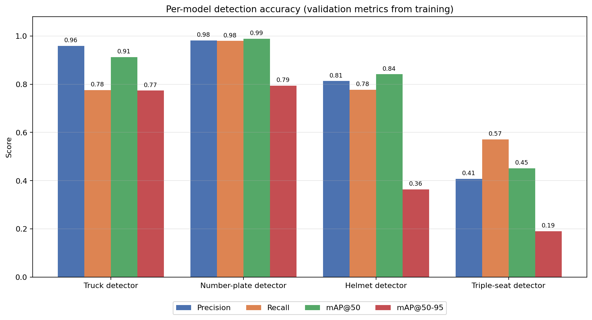
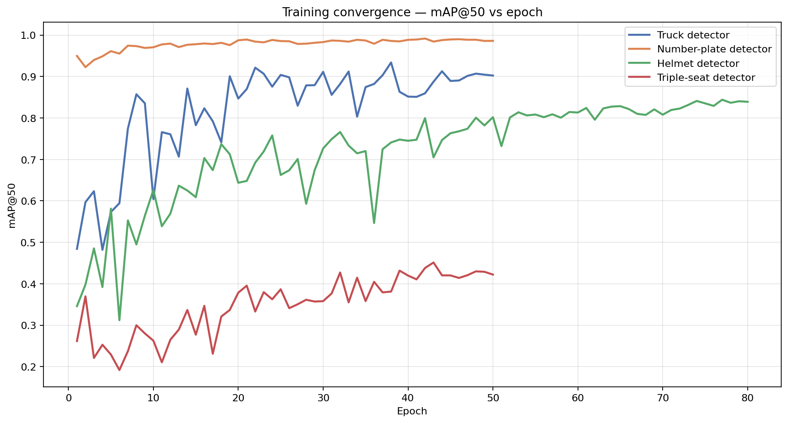

# Model Accuracy & Evaluation

## Methodology

Each detection model is a YOLO checkpoint trained on its own task-specific dataset.
The accuracy figures below are the **validation metrics recorded at the best training
epoch**, read directly from the model checkpoints (Ultralytics stores these in the
`.pt` file). They are the standard object-detection metrics:

- **Precision** — of all boxes the model predicted, the fraction that were correct.
- **Recall** — of all true objects, the fraction the model found.
- **mAP@50** — mean Average Precision at IoU 0.50 (the headline detection score).
- **mAP@50-95** — mean Average Precision averaged over IoU 0.50–0.95 (stricter localization).

The two COCO-pretrained backbones (YOLOv10-S, YOLOv8-n) are used off-the-shelf for the
red-light and no-parking zone engines; they have no project-specific validation split,
so their published COCO val2017 mAP is listed for reference.

All numbers are reproducible with:

```bash
python reports/build_accuracy_report.py
```

## Per-model accuracy

| Model | Weights | Used for | Precision | Recall | mAP@50 | mAP@50-95 | Source |
|---|---|---|---|---|---|---|---|
| Truck detector | `truck.pt` | Truck restricted-hours | 0.959 | 0.775 | 0.913 | 0.773 | Trained val split |
| Number-plate detector | `plate_best.pt` | Plate localization (for OCR) | 0.981 | 0.979 | 0.989 | 0.794 | Trained val split |
| Helmet detector | `helmet_best.pt` | No-helmet rule | 0.813 | 0.777 | 0.841 | 0.364 | Trained val split |
| Triple-seat detector | `triple.pt` | Triple-riding rule | 0.407 | 0.571 | 0.451 | 0.191 | Trained val split |
| YOLOv10-S | `yolov10s.pt` | Red-light engine | — | — | — | 0.463 | COCO benchmark (published) |
| YOLOv8-n | `yolov8n.pt` | No-parking + vehicle/rider scoping | — | — | — | 0.373 | COCO benchmark (published) |

### Per-model accuracy (chart)



### Training convergence



## Discussion

- **Number-plate detection is the strongest component** (mAP@50 = 0.989, precision and
  recall ≈ 0.98). Reliable plate localization is what lets the OCR stage work on clean
  crops rather than the full frame.
- **Truck detection is strong** (mAP@50 = 0.913, precision = 0.959): very few false
  trucks. The recall of 0.775 indicates some distant/occluded trucks are missed.
- **Helmet detection is moderate** (mAP@50 = 0.841). The lower mAP@50-95 (0.364) shows
  the boxes are detected but loosely localized, which is consistent with the noisy
  frame-to-frame helmet/no-helmet calls that the rule layer smooths with per-rider
  tracking and a confidence threshold.
- **Triple-seat detection is the weakest model** (mAP@50 = 0.451, mAP@50-95 = 0.191) and
  is the clearest candidate for more/better training data in future work.

## Plate OCR (recognition) — to be measured

The plate **detector** above only localizes the plate. Reading the characters is done by
EasyOCR on the cropped plate. OCR quality should be reported separately as:

- **Exact-match accuracy** — fraction of plates where the predicted string equals the
  ground-truth string.
- **Character Error Rate (CER)** — edit distance / number of ground-truth characters.

This requires a small labelled set of plate crops with their true text. The pipeline
already saves plate crops, so collecting this set is straightforward.

## System-level (end-to-end) accuracy — to be measured

The metrics above are component (detection) accuracy. The overall system should also be
reported as an **event-level confusion matrix** per violation type
(red-light, no-parking, helmet, triple, truck restricted-hours):

| Term | Meaning |
|---|---|
| TP | A real violation that the system flagged |
| FP | The system flagged something that was not a violation |
| FN | A real violation the system missed |

From these, report **precision, recall and F1 per violation type**. The predicted events
are already persisted to `violations.db` (`violation_type`, `track_id`, `frame_index`,
`t_sec`), so this only needs a few test videos with the true violations annotated
(type + approximate timestamp) to diff against.

## Limitations / notes

- A full N×N **confusion matrix** per detector is produced by the training run
  (`confusion_matrix.png` in each model's Ultralytics `runs/` folder). It is not embedded
  in the `.pt` file, so it must be taken from the original training output, or regenerated
  by running `model.val()` against the original validation dataset.
- The COCO-pretrained backbones' numbers are generic benchmarks, not measured on
  traffic-scene data; treat them as indicative only.
